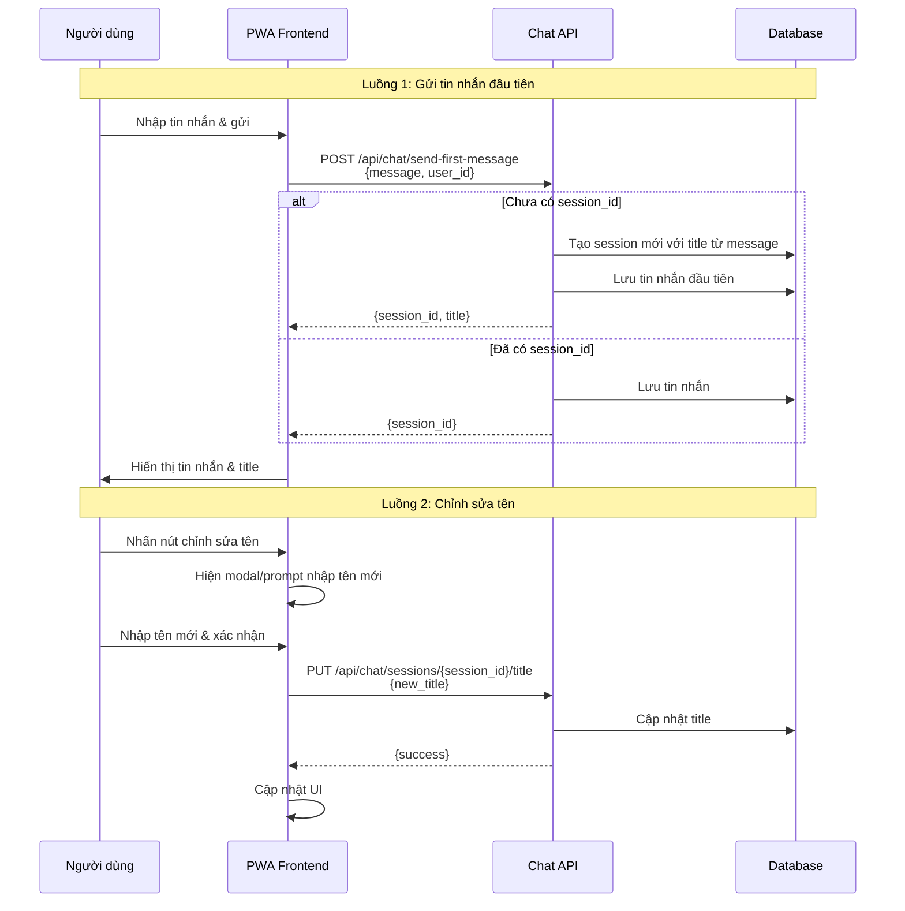

# Kế hoạch Tính năng Tự đặt tên & Chỉnh sửa Cuộc hội thoại

## Tổng quan

Tính năng này cho phép:
1. **Tự động tạo session** khi người dùng gửi tin nhắn đầu tiên
2. **Tự động đặt tên** cuộc hội thoại dựa trên tin nhắn đầu tiên của người dùng
3. **Chỉnh sửa tên** cuộc hội thoại thủ công

---

## 1. Phân tích hiện trạng

### Các file liên quan:
- [`chat_manager.py`](../chat_manager.py) - Quản lý sessions và messages
- [`routers/chat.py`](../routers/chat.py) - API endpoints
- [`pwa/js/chat.js`](../pwa/js/chat.js) - Frontend chat logic
- [`pwa/chat.html`](../pwa/chat.html) - Chat UI

### Cấu trúc dữ liệu hiện tại:
```json
// session_summaries table
{
  "id": int,
  "user_id": int,
  "summary_text": JSON metadata,
  "embedding": array
}

// summary_text structure:
{
  "title": "Cuộc trò chuyện",
  "created_at": "2024-01-01T00:00:00Z",
  "status": "active",
  "message_count": 0
}
```

### Các hàm đã có:
- [`chat_manager.create_new_session()`](chat_manager.py:17) - Tạo session mới
- [`chat_manager.update_session_title()`](chat_manager.py:142) - Cập nhật title
- [`chat_manager.save_message()`](chat_manager.py:224) - Lưu message
- [`generate_session_title()`](routers/chat.py:91) - Tạo title bằng AI

---

## 2. Kiến trúc mới



---

## 3. Backend Implementation Plan

### 3.1. Thay đổi [`chat_manager.py`](chat_manager.py)

#### Hàm mới: `create_session_with_first_message()`
```python
def create_session_with_first_message(self, user_id: str, first_message: str) -> dict:
    """
    Tạo session mới với title được trích từ tin nhắn đầu tiên.
    
    Args:
        user_id: User ID
        first_message: Tin nhắn đầu tiên của người dùng
    
    Returns:
        dict: {success, session_id, title}
    """
    # 1. Trích xuất title từ tin nhắn (lấy 30-50 ký tự đầu)
    # 2. Tạo session mới với title này
    # 3. Lưu tin nhắn đầu tiên
    # 4. Trả về session_id và title
```

#### Hàm mới: `generate_title_from_message()`
```python
def generate_title_from_message(self, message: str) -> str:
    """
    Tạo title từ tin nhắn.
    
    Strategies:
    1. Nếu message ngắn (<50 chars): dùng chính message làm title
    2. Nếu message dài: lấy 40-50 ký tự đầu + "..."
    3. Nếu có topic keywords: tạo title ngắn gọn
    """
```

### 3.2. Thay đổi [`routers/chat.py`](routers/chat.py)

#### API Endpoint mới: `POST /api/chat/send-first-message`
```python
@router.post("/api/chat/send-first-message")
async def send_first_message(request: FirstMessageRequest):
    """
    Gửi tin nhắn đầu tiên - tự động tạo session và đặt tên.
    
    Request body:
    {
        "user_id": str,
        "message": str,
        "images": optional[list]
    }
    
    Returns:
    {
        "success": bool,
        "session_id": int,
        "title": str
    }
    """
```

#### Cải thiện: `PUT /api/chat/sessions/{session_id}/title`
```python
@router.put("/api/chat/sessions/{session_id}/title")
async def update_session_title(session_id: int, request: UpdateTitleRequest):
    """
    Cập nhật title của session.
    
    Request body:
    {
        "title": str,
        "user_id": str  # Để verify ownership
    }
    """
```

---

## 4. Frontend Implementation Plan

### 4.1. Thay đổi [`pwa/chat.html`](pwa/chat.html)

#### Thêm nút chỉnh sửa tên trong header:
```html
<!-- Trong header, sau title -->
<button onclick="editSessionTitle()" 
    class="w-8 h-8 rounded-full hover:bg-white/5 flex items-center justify-center text-white/40 hover:text-white transition-colors"
    title="Đổi tên cuộc trò chuyện">
    <span class="material-symbols-outlined text-[18px]">edit</span>
</button>
```

#### Thêm modal chỉnh sửa tên:
```html
<!-- Modal -->
<div id="editTitleModal" class="hidden fixed inset-0 bg-black/50 z-50 flex items-center justify-center">
    <div class="bg-[#0A0F1E] rounded-2xl p-6 w-full max-w-md mx-4 border border-white/10">
        <h3 class="text-lg font-semibold mb-4">Đổi tên cuộc trò chuyện</h3>
        <input type="text" id="newTitleInput" class="w-full bg-white/5 border border-white/10 rounded-xl px-4 py-3 text-white" />
        <div class="flex gap-3 mt-4">
            <button onclick="closeEditTitleModal()" class="flex-1 py-2 rounded-xl bg-white/5 hover:bg-white/10">Hủy</button>
            <button onclick="saveNewTitle()" class="flex-1 py-2 rounded-xl bg-primary hover:bg-primary-light">Lưu</button>
        </div>
    </div>
</div>
```

### 4.2. Thay đổi [`pwa/js/chat.js`](pwa/js/chat.js)

#### Thêm functions:
```javascript
// Mở modal chỉnh sửa tên
function editSessionTitle() {
    const modal = document.getElementById('editTitleModal');
    const input = document.getElementById('newTitleInput');
    input.value = currentSessionTitle;
    modal.classList.remove('hidden');
}

// Đóng modal
function closeEditTitleModal() {
    document.getElementById('editTitleModal').classList.add('hidden');
}

// Lưu tên mới
async function saveNewTitle() {
    const newTitle = document.getElementById('newTitleInput').value.trim();
    if (!newTitle) return;
    
    const res = await fetch(`${API_URL}/api/chat/sessions/${CURRENT_SESSION_ID}/title`, {
        method: 'PUT',
        headers: {'Content-Type': 'application/json'},
        body: JSON.stringify({ title: newTitle, user_id: USER_ID })
    });
    
    if (res.ok) {
        currentSessionTitle = newTitle;
        document.getElementById('sessionTitle').textContent = newTitle;
        loadSessionList(); // Refresh sidebar
        closeEditTitleModal();
    }
}

// Cập nhật title trong WebSocket message khi nhận
function handleSessionCreated(data) {
    CURRENT_SESSION_ID = data.session_id;
    currentSessionTitle = data.title;
    localStorage.setItem('current_session_id', CURRENT_SESSION_ID);
    document.getElementById('sessionTitle').textContent = data.title;
    loadSessionList();
}
```

---

## 5. Database Schema Changes

**Không cần thay đổi** - Đã có sẵn:
- `session_summaries` table với `summary_text` lưu metadata
- `chat_messages` table lưu messages

---

## 6. Chi tiết từng bước triển khai

### Phase 1: Backend Changes
1. Thêm `generate_title_from_message()` vào `chat_manager.py`
2. Thêm `create_session_with_first_message()` vào `chat_manager.py`
3. Thêm endpoint `POST /api/chat/send-first-message` vào `routers/chat.py`
4. Cập nhật endpoint `PUT /api/chat/sessions/{session_id}/title` để verify ownership

### Phase 2: Frontend UI Changes
1. Thêm nút edit vào header trong `chat.html`
2. Thêm modal HTML cho edit title trong `chat.html`
3. Thêm CSS cho modal trong `chat.html` hoặc `styles.css`

### Phase 3: Frontend Logic Changes
1. Thêm `editSessionTitle()`, `closeEditTitleModal()`, `saveNewTitle()` vào `chat.js`
2. Cập nhật `sendMessage()` để handle session creation on first message
3. Cập nhật `loadSessionList()` để hiển thị edit button trong sidebar

---

## 7. Testing Plan

### Unit Tests:
- `test_generate_title_from_message()` - Test title extraction
- `test_create_session_with_first_message()` - Test session creation
- `test_update_session_title()` - Test title update

### Integration Tests:
- Test gửi tin nhắn đầu tiên → tự tạo session
- Test chỉnh sửa tên → cập nhật DB
- Test hiển thị tên mới trong sidebar và header

---

## 8. Edge Cases

1. **Tin nhắn quá ngắn**: Dùng chính tin nhắn làm title
2. **Tin nhắn quá dài**: Truncate sau 50 ký tự
3. **Unicode/Vietnamese**: Hỗ trợ tiếng Việt đầy đủ
4. **Empty message**: Không tạo session, hiện thông báo lỗi
5. **Session không tồn tại**: Xử lý lỗi gracefully

---

## 9. Backward Compatibility

- Các API cũ vẫn hoạt động bình thường
- Session cũ vẫn hiển thị đúng title
- Không ảnh hưởng đến chức năng hiện có
