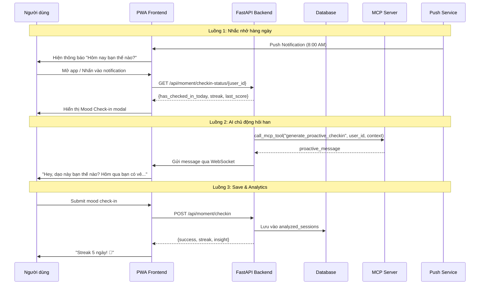

# Kế hoạch Tính năng Mood Check-in Hàng ngày

## Tổng quan

Mở rộng tính năng Moment Check-in hiện có với:
1. **Nhắc nhở tự động** - Push notification hàng ngày
2. **Hỏi han chủ động (AI Proactive)** - AI chủ động hỏi thăm theo context
3. **Streak tracking** - Theo dõi streak check-in
4. **Weekly insights** - Tổng hợp cảm xúc tuần

---

## 1. Kiến trúc mới



---

## 2. Chi tiết AI Proactive Message

### 2.1. Các loại Proactive Messages

AI sẽ gửi message chủ động trong các trường hợp sau:

| Trigger | Thời điểm | Ví dụ Message |
|---------|-----------|---------------|
| **Morning greeting** | 7-10 AM | "Chào buổi sáng! Hôm nay bạn thế nào? ☀️" |
| **Afternoon check** | 12-14 PM | "Giờ nghỉ trưa rồi, mọi thứ ổn không? 🌤️" |
| **Evening reflection** | 18-21 PM | "Cuối ngày rồi, hôm nay của bạn thế nào? 🌙" |
| **Low mood follow-up** | Sau check-in có score < 5 | "Mình lo cho bạn. Có gì muốn chia sẻ không? 💙" |
| **High mood celebration** | Sau check-in có score > 8 | "Thấy bạn vui mình cũng vui theo! ✨" |
| **Streak milestone** | Đạt streak 3, 7, 14, 30 ngày | "Wow! 7 ngày liên tiếp rồi! Bạn tuyệt vời! 🔥" |
| **Long gap check** | Không chat 2+ ngày | "Mình nhớ bạn! Dạo này thế nào? 💭" |

### 2.2. AI Prompt cho Proactive Message

```python
PROACTIVE_MESSAGE_PROMPT = """
Bạn là Miru, một AI đồng hành thân thiện. 
Hãy tạo một tin nhắn hỏi thăm ngắn gọn, ấm áp cho user dựa trên thông tin sau:

Thông tin user:
- Thời gian hiện tại: {current_time}
- Lần check-in gần nhất: {last_checkin}
- Điểm cảm xúc lần trước: {last_score}/10
- Số ngày streak hiện tại: {streak}
- Tags lần trước: {tags}

Yêu cầu:
- Tin nhắn ngắn gọn (20-40 từ)
- Ấm áp, quan tâm
- Không hỏi quá nhiều câu hỏi
- Có thể đề cập đến context (công việc, gia đình...)
- Phù hợp với văn hóa Việt Nam
- Thân mật nhưng không quá sến súa

Chỉ trả về tin nhắn, không giải thích.
"""

def generate_proactive_message(user_id: str) -> str:
    """
    Tạo message chủ động hỏi han user.
    """
    # Lấy thông tin user
    user_info = get_user_context(user_id)
    
    # Tạo prompt
    prompt = PROACTIVE_MESSAGE_PROMPT.format(
        current_time=datetime.now().strftime("%H:%M"),
        last_checkin=user_info.get('last_checkin', 'chưa có'),
        last_score=user_info.get('last_score', 'N/A'),
        streak=user_info.get('streak', 0),
        tags=', '.join(user_info.get('tags', []))
    )
    
    # Gọi AI
    response = llm.invoke(prompt)
    return response.content.strip()

### 2.3. Context-aware Examples

```python
# Ví dụ 1: User thường check-in vào buổi sáng với công việc
context = {
    "typical_time": "morning",
    "common_tags": ["#Công_việc"],
    "avg_score": 6.5
}
# → "Chào buổi sáng! Hôm nay công việc thế nào? ☀️"

# Ví dụ 2: User đang có streak 5 ngày, score lần trước là 9
context = {
    "streak": 5,
    "last_score": 9,
    "last_tags": ["#Sở_thích", "#Bạn_bè"]
}
# → "5 ngày rồi sao? Thấy bạn vui mình cũng vui theo! Hôm nay có gì thú vị không? ✨"

# Ví dụ 3: User không chat 3 ngày, lần cuối score = 3
context = {
    "days_since_last": 3,
    "last_score": 3,
    "is_low_mood": True
}
# → "Mình nhớ bạn! 🥺 Dạo này có gì không ổn không? Mình luôn ở đây để lắng nghe."
```

### 2.4. Logic gửi Proactive Message

```python
class ProactiveMessageScheduler:
    """
    Quản lý việc gửi proactive messages.
    """
    
    def __init__(self):
        self.scheduler = AsyncIOScheduler()
    
    async def should_send_message(self, user_id: str) -> bool:
        """
        Quyết định có nên gửi message cho user không.
        """
        # 1. Kiểm tra user đã check-in hôm nay chưa
        if await has_checked_in_today(user_id):
            return False
        
        # 2. Kiểm tra đã gửi message hôm nay chưa
        if await has_sent_message_today(user_id):
            return False
        
        # 3. Kiểm tra user active (có chat trong 7 ngày qua)
        if not await is_user_active(user_id, days=7):
            return False
        
        # 4. Kiểm tra thời điểm phù hợp
        if not self.is_good_time_to_send():
            return False
        
        return True
    
    def is_good_time_to_send(self) -> bool:
        """Kiểm tra thời điểm phù hợp để gửi."""
        hour = datetime.now().hour
        
        # Tránh các khung giờ:
        # - 23:00 - 07:00 (đang ngủ)
        # - 12:00 - 13:00 (giờ nghỉ trưa - tùy chọn)
        
        good_hours = [7, 8, 9, 10, 11, 14, 15, 16, 17, 18, 19, 20, 21, 22]
        return hour in good_hours

### 2.5. WebSocket Integration

```python
# Khi AI quyết định gửi proactive message
async def send_proactive_checkin(websocket: WebSocket, user_id: str):
    """
    Gửi proactive check-in message qua WebSocket.
    """
    message = await generate_proactive_message(user_id)
    
    await websocket.send_json({
        "type": "proactive_checkin",
        "message": message,
        "timestamp": datetime.now(timezone.utc).isoformat(),
        "actions": [
            {"label": "💭 Trả lời", "action": "reply"},
            {"label": "✅ Đã check-in", "action": "checkin_done"},
            {"label": "⏰ Để sau", "action": "snooze"}
        ]
    })
    
    # Log đã gửi
    await log_proactive_sent(user_id, message)
```

### 2.6. Frontend Handle Proactive Message

```javascript
// Trong chat.js hoặc ReflectionChat class
handleProactiveCheckin(data) {
    // Hiển thị message với action buttons
    const messageHtml = `
        <div class="proactive-checkin animate-fade-in">
            <div class="proactive-avatar">🌸</div>
            <div class="proactive-content">
                <p>${data.message}</p>
                <div class="proactive-actions">
                    <button onclick="handleProactiveAction('reply')">💭 Trả lời</button>
                    <button onclick="handleProactiveAction('checkin_done')">✅ Đã check-in</button>
                    <button onclick="handleProactiveAction('snooze')">⏰ Để sau</button>
                </div>
            </div>
        </div>
    `;
    
    document.getElementById('messagesList').insertAdjacentHTML('beforeend', messageHtml);
}

async function handleProactiveAction(action) {
    if (action === 'reply') {
        // Focus vào input
        document.getElementById('messageInput').focus();
    } else if (action === 'checkin_done') {
        // Mở moment check-in
        if (window.momentCheckin) {
            window.momentCheckin.open();
        }
    } else if (action === 'snooze') {
        // Nhắc lại sau 1 giờ
        localStorage.setItem('snooze_proactive_until', Date.now() + 3600000);
    }
}
```

---

## 3. Backend Changes (tiếp)

### 3.1. Cập nhật [`pwa/js/moment-checkin.js`](pwa/js/moment-checkin.js)

#### Thêm: Daily reminder UI
```javascript
class MomentCheckin {
    constructor() {
        // ... existing code ...
        
        // Daily check-in state
        this.streak = 0;
        this.hasCheckedInToday = false;
        
        // Notification settings
        this.notificationEnabled = false;
        this.notificationTime = "08:00";
    }
    
    // ... existing methods ...
    
    // NEW: Check status on init
    async checkDailyStatus() {
        try {
            const userId = localStorage.getItem('user_id');
            const res = await fetch(`/api/moment/checkin-status/${userId}`);
            const data = await res.json();
            
            if (data.success) {
                this.streak = data.streak;
                this.hasCheckedInToday = data.has_checked_in_today;
                
                // Show streak badge if applicable
                if (this.streak >= 3) {
                    this.showStreakBadge(this.streak);
                }
            }
        } catch (e) {
            console.error('Error checking status:', e);
        }
    }
    
    showStreakBadge(streak) {
        // Add streak badge to chat UI
        const badge = document.createElement('div');
        badge.className = 'streak-badge animate-bounce';
        badge.innerHTML = `🔥 ${streak} ngày liên tiếp!`;
        document.getElementById('messagesList')?.prepend(badge);
    }
    
    // NEW: Override save to include streak
    async save() {
        const userId = localStorage.getItem('user_id');
        
        const data = {
            user_id: userId,
            emotion_score: this.emotionScore,
            context_tags: Array.from(this.selectedTags),
            note: this.note || null
        };
        
        try {
            const response = await fetch('/api/moment/checkin', {
                method: 'POST',
                headers: { 'Content-Type': 'application/json' },
                body: JSON.stringify(data)
            });
            
            const result = await response.json();
            
            if (result.success) {
                this.streak = result.streak;
                this.hasCheckedInToday = true;
                
                // Show success with streak
                this.showStreakCelebration(result);
                
                if (window.reflectionChat) {
                    window.reflectionChat.addMessage(result.message, 'ai');
                }
                this.close();
            }
        } catch (error) {
            // Fallback to old endpoint
            await this.saveOldWay(data);
        }
    }
    
    showStreakCelebration(result) {
        const celebration = document.createElement('div');
        celebration.className = 'streak-celebration';
        celebration.innerHTML = `
            <div class="text-4xl">🎉</div>
            <div class="font-semibold text-lg">${result.message}</div>
            ${result.insight ? `<div class="text-sm opacity-80 mt-2">${result.insight}</div>` : ''}
        `;
        document.body.appendChild(celebration);
        
        setTimeout(() => celebration.remove(), 3000);
    }
}
```

### 3.2. Cập nhật [`pwa/chat.html`](pwa/chat.html)

#### Thêm: Notification toggle button
```html
<!-- Trong settings hoặc sidebar -->
<div class="notification-settings">
    <label class="flex items-center gap-3 p-3 rounded-xl hover:bg-white/5 cursor-pointer">
        <span class="material-symbols-outlined">notifications</span>
        <span class="flex-1">Nhắc nhở hàng ngày</span>
        <input type="checkbox" id="dailyReminderToggle" class="toggle">
    </label>
    
    <div id="reminderTimeSetting" class="hidden pl-10 pr-3 py-2">
        <label class="text-xs text-white/40">Giờ nhắc nhở</label>
        <input type="time" id="reminderTime" value="08:00" 
            class="w-full bg-white/5 border border-white/10 rounded-lg px-3 py-2 text-white">
    </div>
</div>
```

---

## 4. Database Schema Changes

### Thêm bảng `user_settings` (hoặc extend `users` table):
```sql
CREATE TABLE user_settings (
    id SERIAL PRIMARY KEY,
    user_id INTEGER REFERENCES users(id),
    daily_reminder_enabled BOOLEAN DEFAULT FALSE,
    reminder_time TIME DEFAULT '08:00',
    preferred_checkin_time_slot VARCHAR(20), -- 'morning', 'afternoon', 'evening'
    created_at TIMESTAMP DEFAULT NOW(),
    updated_at TIMESTAMP DEFAULT NOW()
);
```

---

## 5. Push Notification Implementation

### Service Worker: `pwa/service-worker.js`
```javascript
// Push notification handler
self.addEventListener('push', function(event) {
    const data = event.data?.json() || {};
    
    const options = {
        body: data.body || 'Hôm nay bạn thế nào? ☀️',
        icon: '/pwa/images/icon-192.svg',
        badge: '/pwa/images/badge-72.png',
        tag: 'daily-mood-checkin',
        data: {
            url: data.url || '/app/chat'
        },
        actions: [
            { action: 'checkin', title: '✏️ Check-in ngay' },
            { action: 'later', title: '⏰ Nhắc sau' }
        ]
    };
    
    event.waitUntil(
        self.registration.showNotification('Miru - Mood Check-in', options)
    );
});

// Notification click handler
self.addEventListener('notificationclick', function(event) {
    event.notification.close();
    
    if (event.action === 'checkin') {
        event.waitUntil(
            clients.openWindow(event.notification.data.url)
        );
    }
});
```

---

## 6. Edge Cases

1. **User không check-in 1 ngày**: Reset streak về 0
2. **Missed notifications**: Thử lại sau 1 giờ
3. **Timezone**: Sử dụng local timezone của user
4. **Permission denied**: Fallback to in-app reminder
5. **Multiple check-ins/ngày**: Chỉ tính 1 lần cho streak

---

## 7. Testing Plan

### Unit Tests:
- `test_calculate_streak()` - Tính streak đúng
- `test_generate_proactive_message()` - Message phù hợp context

### Integration Tests:
- Test save check-in → streak update
- Test push notification flow
- Test notification permission handling

---

## 8. Backward Compatibility

- Endpoint `/api/moment` cũ vẫn hoạt động
- MomentCheckin modal không thay đổi UI
- Không ảnh hưởng đến dữ liệu hiện có
